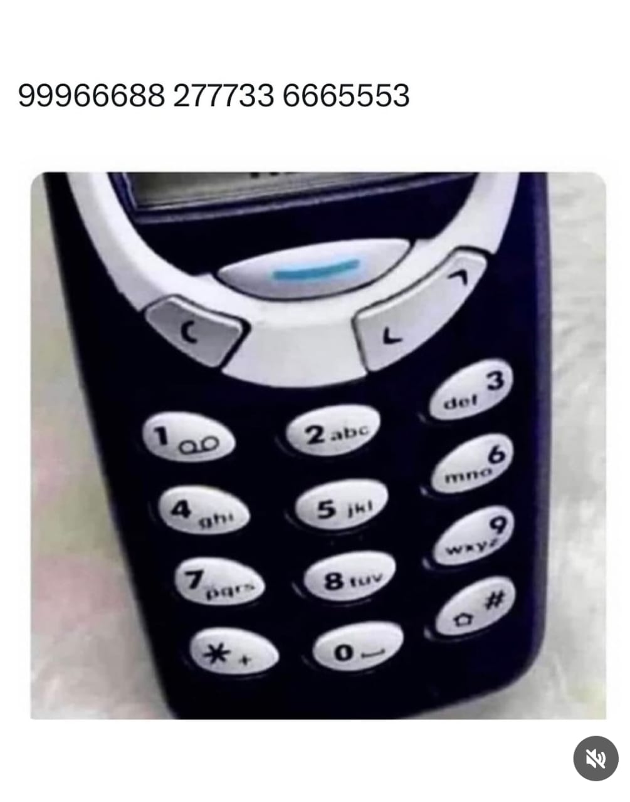

# 3310-go

A simple parser from and to `3310` phone key bindings and English.

## Key Bindings

| Key | Letters                |
| --- | ---------------------- |
| `0` | Space literal ` `.     |
| `1` | Nothing.               |
| `2` | `a`, `b` and `c`.      |
| `3` | `d`, `e` and `f`.      |
| `4` | `g`, `h` and `i`.      |
| `5` | `j`, `k` and `l`.      |
| `6` | `m`, `n` and `o`.      |
| `7` | `p`, `q`, `r` and `s`. |
| `8` | `t`, `u` and `v`.      |
| `9` | `w`, `x`, `y` and `z`. |

## Rules

### How do we represent numbers?

Prefix it with a space literal ` `.

#### Example

- `12th` -> `12` `t` `h` -> ` 1` `2844` ` 12844`.

### How do we represent two letters that come consecutively in the same word using the same key binding?

Prefix it with `1`.

#### Examples

- `high` -> `h` `i` `g` `h` -> `44` `1` `444` `1` `4` `1` `44` -> `44144414144`.
- `moon` -> `m` `o` `o` `n` -> `6` `1` `666` `1` `666` `1` `66` -> `616661666166`.

### How do we represent upper case letters?

Prefix it with `_` underscore.

#### Examples

- `I am` -> `I` ` ` `a` `m` -> `_` `5` `0` `2` `6` -> `_5026`.

### How do we represent special characters?

Use them, with below exceptions that have to be written twice to represent said character.

For instance, underscore `_` used for upper-casing a letter.

#### Examples

- `r&d` -> `r` `&` `d` -> `777` `&` `3` -> `777&3`.
- `r_d` -> `r` `_` `d` -> `777` `__` `3` -> `777__3`.
